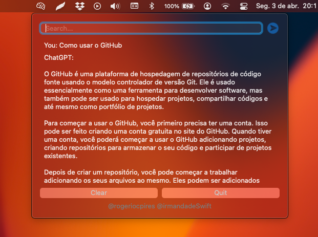

# ChatGPTToolbar

ChatGPTToolbar é uma aplicação para macOS, feito 100% em [SwiftUI](https://developer.apple.com/tutorials/swiftui) e utilizando o [MenuBarExtra](https://developer.apple.com/documentation/swiftui/menubarextra/) que esta disponível para macOS 13.0+

## Ajuda
Estou precisando de ajuda para implementar novas funcionalidade e também criar uma tecla de atalho para chmar diretamente pelo teclado.

### Agradecimentos
Gostaria de agradecer o [Michel Lopes](https://www.instagram.com/michellopes_/) e o [Gustavo Feliciano](https://www.instagram.com/gustavoflcn/) Pelo incentivo.

E a nossa queria [irmandadeSwift](https://www.irmandadeswift.com/)

